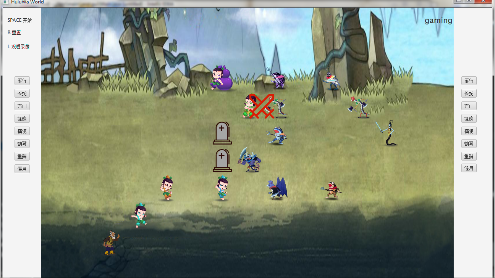
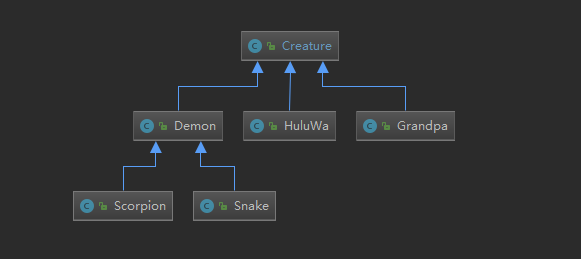
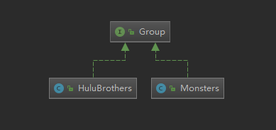
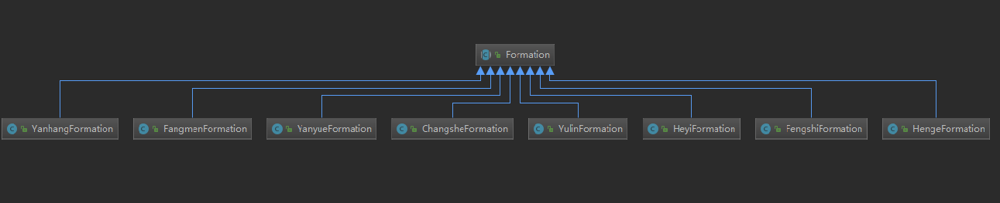
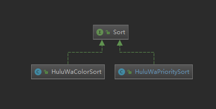

# Java Final Project
* 161220108 侍林天 <254656131@qq.com>
## 开发环境
* IntelliJ IDEA 2018.2.5 (Ultimate Edition)
* Java版本 1.8.0_181
* Maven 3.6.0
## 项目简介
* HuluWa World是一个葫芦娃与妖精对战的游戏。游戏开始前玩家可以布置阵型，游戏开始后葫芦娃与妖精自动进行战斗。
* 除了战斗功能外，还支持录像回看。
## 运行截图  

## 运行说明
* 使用Maven对项目进行编译，打包。
* 运行target目录下HuluWa-1.0-SNAPSHOT.jar。
* 进入游戏后，可以通过两侧按钮和对单位鼠标拖拽的方式进行排兵布阵。
* 按SPACE键开始游戏。按R键重置游戏状态。按L键选择录像进行回放。
* 上一盘游戏的录像文件保存在游戏程序同一目录下。新的游戏会覆盖上一次游戏的录像。
## 项目详情
### 目录
* /replay 存放了录像，以供回放使用。
* /ScreenShots 存放了README.md使用到的图片
* /src/main/java 项目源代码
* /src/main/resources 项目资源文件
* /src/test/java 单元测试代码
### 代码结构
#### gui
* class Main是整个程序的入口。
* class GameController是JavaFX框架，使用FXML Scene Builder工具的一个控制器。整个处理程序的各种外部事件处理函数、画面刷新函数等都在该类里。
* class GUIRefresher用于定时进行刷新画面。
#### package space
* class Tile是二维平面的基本组成单位，生物体能够放置在Tile上。Tile具有一系列接口可以判断该Tile对象上是否有生物体、将该Tile对象上的生物体移除、在该Tile上放置一个生物体等。  
```java
public class Tile<T extends Creature> {
    private int coordinateX;
    private int coordinateY;
    private T creatureStandOnTile;
    public void removeCreatureStandOnTile() {
        /*...*/
    }
    public void setCreatureStandOnTile(T x) {
        /*...*/
    }
    public boolean isEmpty() {
        /*...*/
    }
    public Creature getCreature() {
        /*...*/
    }
}
```
* class TwoDimensionSpace实现了一个由Tile组成的二维平面。利用Tile类提供的接口，可以对TwoDimensionSpace对象的某一个坐标进行操作。
```java
public class TwoDimensionSpace<T extends Creature> {
    private Tile<T> space[][];
    private int size;
    private int sizeM;
    private int sizeN;
    public boolean isEmpty(int x, int y) {
        /*...*/
    }
    public boolean isCreatureOn(int x, int y) {
        /*...*/
    }
    public Creature getCreature(int x, int y) {
        /*...*/
    }
    /*...*/
}
```
* class Coordinate具有两个成员，记录X轴坐标和Y轴坐标，用于生物体寻找路径等需要用到二元数对的地方记录坐标。
#### package creature
* class Creature是所有生物体的基类，能够在二维平面上行走战斗。并且实现了Runnable接口。
```java
public class Creature implements Runnable{
    /*...*/
}
```
* class Demon继承于Creature。
* class HuluWa继承于Creature。
* class Grandpa继承于Creature。
* class Snake继承于Demon。
* class Scorpion继承于Demon。  

#### package group
* interface Group是一个公共接口，实现该接口的类应能够进行排列阵型。
```java
public interface Group {
    public void generateFormation(Formation formation, TwoDimensionSpace space, int x, int y, int direction);
    public void initialize();
}
```
* class HuluBrothers实现了Group接口，并由一组HuluWa对象和一个Grandpa对象组合而成，是游戏中的葫芦娃阵营。
* class Monsters实现了Group接口，并由一组Demon对象组合而成，是游戏中的妖怪阵营。   

#### package Formation
* abstract class Formation是一个抽象类，并具有一个抽象接口用于排列阵型。
```java
public abstract class Formation {
    public abstract void generateFormation(TwoDimensionSpace space, Creature beings[], Creature ob, int x, int y, int direction);
}
```
* class ChangsheFormation继承了Formation类，具体实现了长蛇阵法。
* class FangmenFormation继承了Formation类，具体实现了长蛇阵法。
* class FengshiFormation继承了Formation类，具体实现了长蛇阵法。
* class HengeFormation继承了Formation类，具体实现了长蛇阵法。
* class HeyiFormation继承了Formation类，具体实现了长蛇阵法。
* class YanhangeFormation继承了Formation类，具体实现了长蛇阵法。
* class YanyueFormation继承了Formation类，具体实现了长蛇阵法。
* class YulinFormation继承了Formation类，具体实现了长蛇阵法。  

#### package battle
* class BattleField该类由一个二维空间、葫芦娃阵营和妖怪阵营组合而成。包含了葫芦娃游戏所需的所有元素。
#### package replay
* class Replay实现了Runnable接口，void run()函数中实现了录像回看的功能。
* class ReplayWriter提供了一个多个Creature线程共同写文件的解决方案。
#### package navigate
* class Navigation具有一个方法getNavigate，游戏中生物体通过该方法能够绕过障碍物，规划出一条能够到达目的位置的路线。
```java
public class Navigation {
    public HashMap<Integer, Integer> getNavigate(Creature c, TwoDimensionSpace space) {
        /*...*/
    }
```
#### package color
* enum COLOR是一个枚举类型，class HuluWa的颜色属性需要使用。
#### package sort
* interface Sort是一个公共接口，具有一个排序方法,用于对一组葫芦娃进行排序。
```java
public interface Sort {
    public void sort(HuluWa[] brothers);
}
```
* class HuluWaColorSort实现了Sort接口，基于葫芦娃的颜色进行排序。
* class HuluWaPrioritySort实现了Sort接口，基于葫芦娃的排行进行排序。  

#### package annotation
* @interface AuthorAnno是一个生命期至running time的一个类型注解，可以标识一个类的作者和版本。
## 功能实现
### 阵型排列
* 用户可以通过程序界面两侧的按钮布置阵型。用户点击按钮后通过按钮的触发事件处理函数，将生物体排列成相应的阵型。
* 用户也可以通过鼠标拖拽排列生物体。首先定义了一个DragDetect事件，当拖拽开始时，通过坐标转换获得二维空间对应位置的生物体(可能为null)。然后定义了一个Drag事件，在鼠标拖拽过程中不断将生物体移动到鼠标当前坐标对应在二维空间的位置，并刷新画面形成生物体被鼠标拖拽的效果。
* DragDetect和Drag事件的处理函数在游戏进行中都被将被禁用，以免干扰正常的游戏。
```java
@FXML private void canvasDragDetect(MouseEvent event) {
        if (!fighting) {
            return;
        }
        int x = (int)event.getX();
        int y = (int)event.getY();
        x = x / 72;
        y = y / 72;
        if (battle.space.getCreature(y, x) != null) {
            selected = battle.space.getCreature(y, x);
        }
    }

    @FXML private void canvasDrag(MouseEvent event) {
        if (!fighting) {
            return;
        }
        int x = (int)event.getX();
        int y = (int)event.getY();
        x = x / 72;
        y = y / 72;
        if (selected != null) {
            selected.moveTo(battle.space, y, x);
        }
        display();
    }
```
### 战斗功能
* GameController类中有一个成员BattleField battle包含了游戏所需要的二维空间和生物体们。
* 当用户按下空格后，GameController类中的键盘事件处理函数捕捉到该事件，然后通过Thread类运行所有的生物体线程和画面定时刷新线程。
* 通过定时刷新的线程判断游戏是否已经结束，结束条件为某一方全部死亡。
* 在void run()函数里，生物体首先会自己是否已经死亡。
* 如果活着会在forward函数中寻找离该生物体曼哈顿距离最接近的几个敌人，并选择一个作为进攻目标。然后通过walkPathTo函数生成路径进行移动。移动到目标附近后，会调用attack函数对附近的敌人进行攻击。
* 如果生物体已经死亡，进程不会立即结束，该生物体会以墓碑的形式继续存在若干回合，最后才消亡。
* 上述过程循环重复进行，直到一个生物体的生命期结束或者有其他进程关闭了它。
### 线程安全的实现
* 当每个生物线程进行移动和攻击时，对该部分代码加上synchronized锁住，保证一个生物体进程在进行移动和攻击时独享资源，避免冲突。
### 录像回看
* 在ReplayWriter类中有一个静态变量FileWriter out。ReplayWriter中的void write(String data)就通过静态变量FileWriter out进行写文件操作。
```java
public class ReplayWriter {
    private static FileWriter out;
    public ReplayWriter() {
        ;
    }
    public void setOut(FileWriter out) {
        ReplayWriter.out = out;
    }
    public void write(String data) throws Exception {
        out.write(data);
    }
    public void close() throws Exception {
        out.close();
    }
}
```
* 当游戏开始时，首先在游戏目录下创建log文件，然后把该文件的FileWriter赋给ReplayWriter类的静态变量FileWriter out。然后启动所有生物体线程，当生物线程进行move和attack等操作时直接new一个ReplayWriter对象，然后通过write方法可以实现多个线程往同一个log文件中写数据，并且实现了写log文件的功能与Creature类的功能分离。
* 进行录像回放时，首先由用户选择打开一个log文件，然后将该文件的BufferedReader和程序游戏控制器GameController构造一个Replay对象。然后Replay的run方法中定时从BufferedReader br中读取一条记录，对BattleField battle中的数据进行操作，然后通过GameController gc刷新一次UI。
* 虽然每个生物体线程是并发进行的，但运行时记录的写入还是有先后顺序的。录像回放的时候按照记录写入的顺序依次重现记录的操作即可。
```java
public class Replay implements Runnable {
    private BufferedReader br;
    private GameController gc;
    private BattleField battle;
    public Replay(BufferedReader br, GameController gc) {
        this.br = br;
        this.gc = gc;
        this.battle = gc.getBattle();
    }
    public void run() {
        /*...*/
    }
}
```
## 单元测试
* 使用了JUnit对TwoDimensionSpace，Formation等几个模块进行了单元测试。
## 设计原则
### SRP 单一职责原则
* 在Creature类里，需要在void run()函数里记录生物体进程所做的操作，一开始的设计是直接在void run()函数里进行文件读写。后来考虑到文件读写的功能并不是生物体的职责，所以加入了一个ReplayWriter类，对写文件操作进行了封装，在void run()函数里通过ReplayWriter类进行写文件即可，实现了文件操作和Creature类功能的分离。
* Creature类中寻找路径的功能通过Navigation类实现，寻路与Creature类的功能实现分离。
* 将游戏的逻辑与视图分离。Creature类中没有与显示有关的方法，而是通过GUIRefresher类的线程定时刷新画面。
### OCP 开放封闭原则
* 将阵型抽象成一个abstract class Formation，然后具体的阵型通过继续抽象类Formation，实现其中的抽象方法来获得不同的阵型。保证了接口的统一，便于阵型的添加和调用。
### LSP LISKOV替换法则
* 所有从Creature类继承的子类HuluWa、Demon、Grandpa、Snake和Scorpion都可以替换程序中的Creature类。
### ISP 接口隔离原则
* 在葫芦娃游戏的代码设计中，没有出现一个类拥有其功能所不需要的方法。
### CARP 合成/聚合复用原则
* 二维空间类TwoDimensionSpace是有一组Tile类合成而来。
* 战场类BattleField类由Creature的子类和TwoDimensionSpace类聚合而成。

## 思考总结
* 通过葫芦娃这长达一个学期的项目，我对代码进行了反复的迭代。在这个过程中我感受到写出可以运行，没有bug的代码并不是最难的事情。最难的是写出结构清晰，易于扩展和复用的代码，这才是好代码。
* 在coding过程中，有时因为偷懒或疏忽等原因写出了设计糟糕的代码，在不久之后就能感受到了糟糕设计的弊端，于是需要对代码进行重新的设计。不过仍有很多设计我仍觉得不够满意，不过代码的迭代是永无止境的。
* 葫芦娃项目始终是一个人coding的过程，我有时觉得是否两三人合作的大项目更能体会到面向对象设计封装和复用的重要性。因为葫芦娃项目的代码都是我一个人设计的，虽然有些地方不够面向对象，但我能够理解所有类之间的设计和内部信息，如果是和别人合作，有些设计可能就没有足够的封装，数据不够安全。
* 通过本学期Java课程的学习，对面向对象的程序设计有了初步的领悟，能够从更高地层次(封装、复用)去考虑程序设计。
